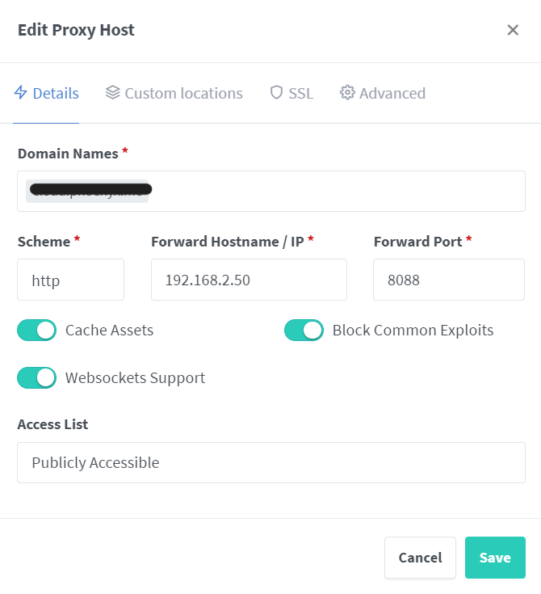

# Anleitung für den Nextcloud Docker Stack

- [Anleitung für den Nextcloud Docker Stack](#anleitung-für-den-nextcloud-docker-stack)
  - [Beschreibung](#beschreibung)
  - [Was benötige ich?](#was-benötige-ich)
    - [Hardware](#hardware)
    - [Vorbereitungen](#vorbereitungen)
      - [Bootloader](#bootloader)
      - [Raspberry Pi Image](#raspberry-pi-image)
      - [Anpassungen am OS](#anpassungen-am-os)
      - [Docker Repo einbinden und installieren](#docker-repo-einbinden-und-installieren)
        - [Alte Version deinstallieren](#alte-version-deinstallieren)
        - [Docker Installation](#docker-installation)
        - [Docker-Compose installation](#docker-compose-installation)
        - [Docker-Compose Cmdline Completion](#docker-compose-cmdline-completion)
          - [Installation aus dem Paket](#installation-aus-dem-paket)
        - [Post Installation Schritte](#post-installation-schritte)
    - [Anpassungen am System](#anpassungen-am-system)
      - [Fix für Redis in Docker Container](#fix-für-redis-in-docker-container)
      - [Fix RAM-Limit für Docker Container](#fix-ram-limit-für-docker-container)
    - [Zusätzliche Software](#zusätzliche-software)
    - [LVM oder MDADM Raid einrichten](#lvm-oder-mdadm-raid-einrichten)
  - [Einrichten und Deployen der Docker Container](#einrichten-und-deployen-der-docker-container)
    - [Einrichten des NginX Proxy Manager](#einrichten-des-nginx-proxy-manager)
    - [Einrichten des Portainer Webfrontend](#einrichten-des-portainer-webfrontend)
    - [Einrichten der Nextcloud](#einrichten-der-nextcloud)
      - [Was ist Nextcloud eigentlich?](#was-ist-nextcloud-eigentlich)
      - [Mein Docker-Compose File für Nextcloud](#mein-docker-compose-file-für-nextcloud)
        - [Volumes und Networks](#volumes-und-networks)
        - [Service Nextcloud Datenbank (Postgre-SQL)](#service-nextcloud-datenbank-postgre-sql)
        - [Service Redis](#service-redis)
        - [Service Postgre-SQL Admin (Optional)](#service-postgre-sql-admin-optional)
        - [Service Nextcloud App](#service-nextcloud-app)
        - [Environment File](#environment-file)
        - [Docker Buildfile](#docker-buildfile)
      - [Anpassungen an der NginX Proxy Manager Config](#anpassungen-an-der-nginx-proxy-manager-config)
  - [Abschluß](#abschluß)
  - [Danksagung](#danksagung)

## Beschreibung

Dieses Repo enthält alle notwendigen Dateien um ein Nextcloud aufzusetzen.
Ich nutze diese Konfiguration auf meinem Raspberry Pi4 mit [DietPi](https://dietpi.com/) und Docker (Docker-Compose). Dafür habe ich einen Reverse Proxy eingebunden und Nutze einen DynDNS Anbieter um von überall darauf zugreifen zu können.

## Was benötige ich?

Als erstes fangen wir mit den Voraussetzungen an.
> Ich werde hier die von mir verwendeten Artikel auflisten und dazu Amazon Partner Links verwenden. Wer will darf mir gerne was gutes tun, wer nicht sucht selbst danach oder nutzt was anderes. Vielen Dank

### Hardware

- Raspberry Pi4
- Gehäuse mit Lüfter oder guten Kühlkörpern [Amazon Partner Link](https://amzn.to/3K7Cb3k)
  Das Netzteil ist echt gut und macht seit knapp einem Jahr keine Probleme, setze es an 4 Raspberry ein, ebenso das Gehäuse.
- Anker USB Adapter [Amazon Partner Link](https://amzn.to/3K27P2m)
- 2 bis 4 USB3 Sticks Ich persönlich bevorzuge hier 256GB [SanDisk](https://amzn.to/3rJnGfU) oder [Intenso](https://amzn.to/390DW5r) oder Entsprechende Platten mit Eigener Stromversorgung
- 1 16Gb bis 32GB Stick für das OS (Auch hier nutze ich einen Intenso oder SanDisk)

### Vorbereitungen

#### Bootloader

- Mit dem Pi Imager den Bootloader USB-Boot fähig machen.

#### Raspberry Pi Image

- Balena Etcher oder Pi Imager nutzen um DietPi auf den 16GB USB Stick zu bekommen.
  - Nach dem das Image auf den USB Stick gebracht wurde den USB Stick einmal abziehen und wieder anstecken. Dann müssen noch ein paar Anpassungen an den Files dietpi.txt und cmdline.txt vorgenommen werden.
  - Die wichtigsten Anpassungen findet ihr hier: [How to do an automatice Base Installation at first boot DietPi](https://dietpi.com/docs/usage/#how-to-do-an-automatic-base-installation-at-first-boot-dietpi-automation)

#### Anpassungen am OS

DietPi bietet durch den [Installations Assistenten](https://dietpi.com/docs/install/#how-to-install-dietpi) schon viele Möglichkeiten und ist daher echt einfach zu konfigurieren.
Wichtig sind für den Betrieb von Docker und den Nextcloud Komponenten folgende Punkte:

- Static IP auf eth0. _Der Betrieb einer NextCloud über Wifi ist möglich aber nicht zu empfehlen._
- Anpassung von Passwörtern (Bitte nutzt nicht die Standard Passwörter sondern vergebt eigene. Dabei ist es nicht wichtig ob irgendwelche Sonderzeichen im Password sind sondern nur die Länge. Ich nutze für Root min 50 Zeichen und für die User min 35 Zeichen nach dem Schema[A-Za-z0-9]).
- Umstellen von Dropbear auf OpenSSH, ist für die aktuelle Konfiguration nicht unbedingt notwendig, solltet ihr aber auf [OMV](https://www.openmediavault.org/) setzen wollen dann geht nur OpenSSH.

Die Anleitung zu Installation und den Schritten danach für DietPi findet ihr in den [DietPi Docs](https://dietpi.com/docs/). **Hier geht auch noch mal mein Dank an das OpenSource Projekt DietPi raus und alle Entwickler und die Community [Donate DietPi](https://dietpi.com/contribute.html).**

Nach dem Ihr euch per SSH verbunden habt kümmern wir uns nun um die Docker Installation und die Anpassungen für Redis und Docker.
Ich nutze hierfür immer das Docker eigene Repo, da dieses grundsätzlich aktueller ist als das von Debian oder anderen Distributionen.

#### Docker Repo einbinden und installieren

##### Alte Version deinstallieren

Wenn eine alte Version von Docker installiert ist sollte diese vorher deinstalliert werden. (Kann bei einer neuen Installation drauf verzichtet werden.)

```bash
sudo apt-get remove docker docker-engine docker.io containerd runc
```

##### Docker Installation

Danach binden wir nun das Repositorie ein und installieren die neue Version.

Notwendige Pakete für das einbinden eines Repositories

```bash
 sudo apt-get update
 sudo apt-get install \
    ca-certificates \
    curl \
    gnupg \
    lsb-release
```

Einbinden des offiziellen Docker GPG Key:

```bash
curl -fsSL https://download.docker.com/linux/debian/gpg | sudo gpg --dearmor -o /usr/share/keyrings/docker-archive-keyring.gpg
```

Repositorie einbinden

```bash
echo \
  "deb [arch=$(dpkg --print-architecture) signed-by=/usr/share/keyrings/docker-archive-keyring.gpg] https://download.docker.com/linux/debian \
  $(lsb_release -cs) stable" | sudo tee /etc/apt/sources.list.d/docker.list > /dev/null
```

Installation Docker Engine

```bash
sudo apt-get update

sudo apt-get install docker-ce docker-ce-cli containerd.io
```

##### Docker-Compose installation

Ich habe mich für die Version 2 des Tools entschieden, da ich gerne MultiContainer Docker Applications nutze.

Für die Intallation einfach folgendes ausführen. Die aktuelle Version findet ihr auf [Github Docker/Compose](https://github.com/docker/compose/releases)

```bash
#Set Version Environment Variable
VERSION=[Latest Version]
sudo curl -SL https://github.com/docker/compose/releases/download/${VERSION}/docker-compose-$(uname -s)-$(uname -m) -o /usr/local/lib/docker/cli-plugins/docker-compose
```

Weitere Details zu Version 2 von Docker-Compose findet ihr in den entsprechenden [Docs](https://docs.docker.com/compose/cli-command/).

##### Docker-Compose Cmdline Completion

Anleitung zur [Installation](https://docs.docker.com/compose/completion/)

###### Installation aus dem Paket

1. Gehe auf [https://download.docker.com/linux/debian/dists/](https://download.docker.com/linux/debian/dists/), wähle deine Debian Version aus und gehe in das richtige Verzeichnis (stable,nightly,test) und wähle dort `arm64` für den Raspberry Pi 4 aus. Lade das entsprechende `.deb` herunter.
2. Installation der Docker Engine. (Wähle deinen Download Pfad entsprechend.)

   ```bash
   sudo dpkg -i /path/to/package.deb
   ```

##### Post Installation Schritte

1. Docker Grupper erstellen
   `sudo groupadd docker`
2. User zur Grupper hinzufügen
   `sudo usermod -aG docker $USER`
3. Unter Linux kannst du mit einem Relogin die Anpassungen aktivieren oder einfach
   `newgrp docker`
4. Überprüfe ob sich `docker` ohne `sudo` ausführen lässt.
   `docker run hello-world`

Eine genaue und ausführliche Beschreibung findet ihr in den [Docker Docs](https://docs.docker.com/), [Installation](https://docs.docker.com/engine/install/debian/), [Post-installation Steps](https://docs.docker.com/engine/install/linux-postinstall/).

### Anpassungen am System

#### Fix für Redis in Docker Container

Die Datei `/etc/sysctl.conf` am Ende erweitern

```text
# fix for redis running in docker
vm.overcommit_memory=1
```

#### Fix RAM-Limit für Docker Container

Standardmäßig ist Docker unter Linux nicht in der Lage RAM-Limits durchzusetzen, ob dies jedoch nicht schon unterstütz wird kann man einfach mit `docker info` prüfen, steht dort am Ende  `Warning: No Swap Limit support` ist dies noch nicht aktiviert.

In der Datei `/boot/cmdline.txt` muss folgendes stehen um dies auf dem Raspberry zu aktivieren.

```text
cgroup_enable=memory cgroup_memory=1 swapaccount=1
```

Weitere Hilfen dazu findet ihr in den Docker Docs unter [cgroup swap limit](https://docs.docker.com/engine/install/linux-postinstall/#your-kernel-does-not-support-cgroup-swap-limit-capabilities)

### Zusätzliche Software

Ich habe noch ein paar zusätzliche Anwendungen auf meinen Pi installiert die mir persönlich dir Arbeit erleichtern. Ob und was ihr davon installiert überlasse ich euch für den Betrieb des der NextCloud sind sie nicht notwendig.

- Git
- GitHub
- nano
- mc
- code (falls ihr wie ich per VSCode und Remote Verbindung arbeiten wollt)

### LVM oder MDADM Raid einrichten

Für die als Storage angeschlossenen USB Sticks oder Festplatten habe ich mich für ein LVM Raid entschieden. Grundsätzlich ist aber auch ein MDADM Raid möglich.

Wichtig ist am Ende nur das ihr den Speicher entsprechend einbindet in Eurer Filesystem und über die Volumes eurer NextCloud Installation als Speicher zur Verfügung stellt.

Das Externe Einbinden von Speichern für die NextCloud werde ich sicher noch mal getrennt behandeln.

## Einrichten und Deployen der Docker Container

### Einrichten des NginX Proxy Manager

Da viele wie ich auch daheim keine Feste IP haben ist es notwendig einen entsprechenden Revers Proxy aufzusetzen um die Anfragen die per DynDNS über eine Domain an den Router bei Euch daheim geschickt werden entsprechend aufzulösen und weiter zu leiten.

Eine genaue Erklärung zu DynDNS, Router Konfig und der Funktion des Revers Proxy, muss ich euch wenn ihr es bis hierher geschafft habt sicher nicht erklären.

Das vollständige Docker-Compose File findet ihr in meinen Repositories [NginX Proxy Manager](https://github.com/meehr/nginx_proxy_manager).

Das File legt die beiden Netzwerke frontend und backend an und gibt euch im Anschluß an dem Rollout unter der Adresse Eures Raspberry Pi und dem Port 81 die Möglichkeit Eure weiterleitungen zu konfigurieren.

Einzelheiten werden in der Readme des Github Repositorie erklärt.

### Einrichten des Portainer Webfrontend

Um es auch für Einsteiger in die Welt der Container möglichst einfach zu gestalten habe ich mich entschieden noch vor der eigentlich Nextcloud ein Webfrontend zur Verwaltung und Konfiguration von einzelenen Container einzurichten.

Auf Grund meiner guten Erfahrungen ist meine Wahl auf [Portainer](https://www.portainer.io/) gefallen. Dies könnt ihr auf dem Raspberry selbst oder auf einem anderen Server laufen lassen und den / die Raspberrys dann mit Agents an den zentralen Portainer Container anbinden.

Ein Repo mit einem entsprechenden docker-compose-file ist vorbereitet.
Ich lasse den Container direkt auf dem Raspberry laufen, auf dem auch später die NextCloud und der NginX Proxy Manager laufen werden. Genaueres findet ihr in der Readme des Repos.

Das Repositorie findet ihr auf [Github.com/meehr](https://github.com/meehr/portainer).

### Einrichten der Nextcloud

#### Was ist Nextcloud eigentlich?

Nextcloud ist eine freie Software für das Speichern von Daten (z. B. Dateien, Kalender, Kontakte etc.) auf einem Server. Auf die Daten kann der Anwender sowohl über eine Weboberfläche als auch mit Client-Applikationen (Smartphone und Desktop) zugreifen. Server und Clients können sich dabei synchronisieren. Nextcloud ermöglicht dem Anwender dadurch, auf einen zentralen und konsistenten Datenbestand von vielen Endgeräten aus zuzugreifen und diesen mit anderen Anwendern optional zu teilen. Neben der Datenhaltung bietet Nextcloud Funktionalitäten für Videokonferenzen und verschiedene Office-Applikationen über die Weboberfläche. (Quelle [Wikipedia](https://de.wikipedia.org/wiki/Nextcloud))

#### Mein Docker-Compose File für Nextcloud

Ich habe das Docker-Compose File welches ihr auf der Nextcloud Seite findet ein bisschen für meine Ansprüche angepasst und zudem um einen Postgre-Admin und um eine Redis ergänzt.

Doch kommen wir zu den einzelnen Segmenten. Ich werde nur die Sachen erklären von denen ich weiß das sie Fragen aufwerfen können. Alle Variablen die ihr in dem Docker-Compose File findet legt ihr in dem Environment-File ( .env ) an und zwar nach dem Prinzip Name=Wert. Ein Beispiel werde ich ebenfall hier anhängen.

##### Volumes und Networks

Wie ihr dem Code entnehmen könnt habe ich keine Volumes für die eigentliche Nextcloud angelegt, da ich diese direkt im Service Segment für die Nextcloud anlege, warum seht ihr später.

```yaml
volumes:
  # Volume für Postgre-SQL und Postgre-Admin
  pgdb:
  pgadmin:

networks:
  # Die Netzwerke erstellt vom NginX Proxy Manager
  nginx_proxy_frontend:
    # add this if the network is already existing!
    external: true
  nginx_proxy_backend:
    # add this if the network is already existing!
    external: true
```

##### Service Nextcloud Datenbank (Postgre-SQL)

  Ich habe mich für eine Postgre-SQL entschieden bei Nextcloud, da mich die notwendigen Anpassungen für MySQL/MariaDB genervt haben und ich mir die DB darunter grundsätzlich egal ist.

```yaml
nextcloud-db:
  container_name:  ${P_HOST}
  hostname:  ${P_HOST}
  image: postgres:alpine
  restart: always
  volumes:
    - pgdb:/var/lib/postgresql/data
    - /etc/localtime:/etc/localtime:ro
    - /etc/timezone:/etc/timezone:ro
  environment:
    # Postgre-SQL Environment
    POSTGRES_PASSWORD: ${P_PW}
    POSTGRES_DB: ${P_DB}
    POSTGRES_USER: ${P_U}
  healthcheck:
    # Healthcheck für den Datenbank Container
    test: ["CMD-SHELL", "pg_isready"]
    interval: 30s
    timeout: 5s
    retries: 5
  ports:
    - '${P_PORT}:5432'
  networks:
    - nginx_proxy_backend
```

##### Service Redis

Um Nextcloud zu beschleunigen setze ich auf eine Redis DB als in Memory Cache. Die notwendigen Einstellungen sind in den aktuellen Nextcloud Versionen automatisch aktiviert. Zumindestens musste ich nichts mehr an der config.php vornehmen.

```yaml
nextcloud-redis:
  image: redis:alpine
  container_name: ${R_CONTAINER}
  hostname: ${R_HOST}
  networks:
    - nginx_proxy_backend
  restart: unless-stopped
  #Redis Passwort eingeben
  command: redis-server --requirepass ${R_PW}
```

##### Service Postgre-SQL Admin (Optional)

Wie schon im Titel geschrieben ist dieser Abschnitt optional, wer gerne eine Grafische Oberfläche für die Verwaltung der Postgre-SQL Datenbank nutzen möchte kann das hiermit tun.

```yaml
# Optional
nextcloud-pgadmin:
  container_name: ${PGADMIN_CONTAINER}
  depends_on:
    - ${R_HOST}
    - ${R_CONTAINER}
  image: dpage/pgadmin4:latest
  environment:
    # PGADMIN Environment
    PGADMIN_DEFAULT_EMAIL: ${PGADMIN_DEFAULT_EMAIL}
    PGADMIN_DEFAULT_PASSWORD: ${PGADMIN_DEFAULT_PASSWORD}
    PGADMIN_CONFIG_SERVER_MODE: 'False'
    POSTGRES_HOST: nc-postgres
  volumes:
    - pgadmin:/var/lib/pgadmin
  ports:
    - "${PGADMIN_PORT}:80"
  networks:
    - nginx_proxy_frontend
    - nginx_proxy_backend
  restart: unless-stopped
#############
```

##### Service Nextcloud App

Die eigentlich App und damit der wichtigste Teil selbst. Hier habe ich die meisten Anpassungen vorgenommen. So habe ich die Default Phone Region direkt im docker-compose File festgelegt und auf das Overwriteprotocol auf https, zudem habe ich noch die Default Email Config mit Hilfe von Environment Variablen festgelegt. Mit ein bisschen Feinschliff lassen sich sicher auch noch die Pfade für CALDAV und CARDDAV anpassen.Doch für den Anfang sollten die vorgenommen Anpassungen die meisten Fehler schon beheben.
Fangen wir an.

1. Container Name und Abhängigkeiten

    Die Datenbanken sollten vor der eigentlichen App gestartet sein
    daher hier das depends_on.

    ```yaml
    nextcloud-app:
      container_name: nc-app
      depends_on:
        - ${P_HOST}
        - ${R_CONTAINER}
    ```

2. Build Anpassungen für Nextcloud Image

    Hier wird eine Build Datei geladen mit deren Hilfe ich das Nextcloud Image gleich um ein paar Anwendungen erweitere. Welche das genau sind beschreibe ich im Verlauf der Readme noch.

    ```yaml
    build: 
      context: .
      dockerfile: docker_nc_pgsql_app
    ```

3. Restart Policies und Ressourcen Limits

    Restart Policie und Ressourcen Limitierung für die Nextcloud, da meine Nextcloud auf einem Raspberry Pi4 mit 4GB Ram läuft, habe ich mich für ein Hardlimit von 2GB entschieden und bisher auch keine Probleme damit gehabt.

    ```yaml
    restart: always
    deploy:
      resources:
        limits:
          memory: 2048M
        reservations:
          memory: 500M
    ```

4. Ports für die Nextcloud

    Den Port könnt ihr Frei wählen, ihr müsst ihn Euch nur merken.

    ```yaml
    ports:
      - '${NC_PORT}:80'
    ```

5. Volumes für die Nextcloud

    Ich habe die Volumes für die Nextxloud hier auf mein LVM Raid gelegt um so weder die Daten noch die für das Webfrontend notwendigen Daten auf USB mit dem Betriebssystem zu haben. Das lässt sich mit Sicherheit schöner lösen, mir war es aber wichtig das es funktioniert und damit habe ich gute Erfahrungen.

    ```yaml
    volumes:
      - type: bind
        source: ${NC_SOURCE}
        target: /var/www/html
      - type: bind
        source: ${NC_DATA_SOURCE}
        target: /var/www/html/data
      - type: bind
        source: ${NC_SOURCE}/custom_apps
        target: /var/www/html/custom_apps
      - type: bind
        source: ${NC_SOURCE}/config 
        target: /var/www/html/config 
    ```

6. Healthcheck Nextcloud

    Healthcheck einfach aber er funktioniert.

    ```yaml
    healthcheck:
      # Healthcheck Nextcloud
      test: curl --fail http://localhost || exit 1
      interval: 30s
      retries: 5
      timeout: 10s
    ```

7. Environment Variablen

    Redis Host und Password

    ```yaml
    environment:
      REDIS_HOST: ${R_HOST}
      # Redis Passwort von oben wieder eingeben
      REDIS_HOST_PASSWORD: ${R_PW}
    ```

    Postgre-SQL

    ```yaml
      POSTGRES_PASSWORD: ${P_PW}
      POSTGRES_DB: ${P_DB}
      POSTGRES_USER: ${P_U}
      POSTGRES_HOST: ${P_HOST}
      POSTGRES_DB_PORT: ${P_PORT}
    ```

    NextCloud

    ```yaml
      # Set overwriteprotocol to https to fix Remote Proxy Failure
      NC_overwriteprotocol: https
      # Set default_phone_region to DE=Germany
      NC_default_phone_region: DE
      # Set Default EMail Config
      SMTP_HOST: ${S_H}
      SMTP_SECURE: SSL
      SMTP_PORT: 465
      SMTP_NAME: ${S_U}
      SMTP_PASSWORD: ${S_PW}
      MAIL_FROM_ADDRESS: ${MAIL_FROM_ADDRESS}
      MAIL_DOMAIN: ${MAIL_DOMAIN}
    ```

    Network

    Die Nextcloud App muss in beiden Netzwerken verbunden sein um auch mit den nur im Backend befindlichen Datenbanken zu sprechen.

    ```yaml
    networks:
      - nginx_proxy_frontend
      - nginx_proxy_backend
    ```

##### Environment File

Da ich viele Variablen benutze habe ich ein entprechendes .env File angelegt. Dieses ist nicht im Repo enthalten, da darin Benutzernamen und PW gespeichert werden. Aber hier ist ein Blanko File welches alle benutzen Variablen enthält und ihr müsst sie nur noch befüllen.

```text
P_PW=
P_DB=
P_U=
P_PORT=
P_HOST=
PGADMIN_PORT=
S_PW=
S_H=
S_U=
R_HOST=
R_CONTAINER=
R_PW=
PGADMIN_DEFAULT_EMAIL=
PGADMIN_CONTAINER=
PGADMIN_DEFAULT_PASSWORD=
NC_PORT=
NC_SOURCE=
NC_DATA_SOURCE=
MAIL_FROM_ADDRESS=
MAIL_DOMAIN=
```

##### Docker Buildfile

Ich habe neben wie unter Punkt 2 des letzten Abschnitts schon angedeutet auch am Image noch ein paar Anpassungen vorgenommen. Diese werden durch ein extra File beim Aufruf in das Image eingebaut. Ihr erzeugt also euer eigenes Image.

Inhalt des  Buildfiles:

```yaml
#Mit diesem Dockerfile werden zusätzliche Packete in den Nextcloud Container gepackt. 
#Dazu gehören in meinem Fall Packete wie Nano oder MC aber auch die SVG Unterstützung für IMagic
#Aufgerufen wird das ganze mit: docker-compose -f "docker-compose-file" up -d --build
#Ich habe mich für diesen Weg entschieden da ich so das Original Docker Image von Nextcloud nutzen
#kann und alles andere nachinstallieren.1

FROM nextcloud:23

ENV DEBIAN_FRONTEND noninteractive
RUN apt update -y && apt upgrade -y  && apt -y install nano mc htop libmagickcore-6.q16-6-extra && apt -y autoclean
```

Nano, mc und htop sind für mich Anwendungen die zu jedem Linux Container gehören. Daher sind diese in den meisten meiner eigenen Images installiert.

libmagickcore sorgt für die svg Unterstützung in Nextcloud.

#### Anpassungen an der NginX Proxy Manager Config

Um die Nextcloud von außen zu erreichen und 2 weitere Fehler in der Nextcloud eigenen Überprüfung sind nach dem Deployen des Nextcloud Containers noch 2 kleine Anpassungen an der NginX Proxy Manager Config zu erledigen.

Dazu ruft ihr die IP Eures Raspi mit dem Port 81 auf und meldet euch beim NginX Proxy Manager an.

Nach der Anmeldung legt ihr den Proxy Host für die Domain unter der ihr Eure NextCloud erreichen wollt fest.

 

## Abschluß

Damit wären wir am Ende der Anleitung / Tutorials. Ich hoffe ich konnte auch Neueinsteigern damit helfen.

## Danksagung

Mein Dank geht vor allem an [Christian Lempa](https://github.com/xcad2k) der mich insperiert hat vor allem im Bereich Nginx Proxy Manager. Und die vielen anderen die in den FB Gruppen oder Raspberry Gruppen meine Ungeduld und Fragen ertragen und beantwortet haben.
